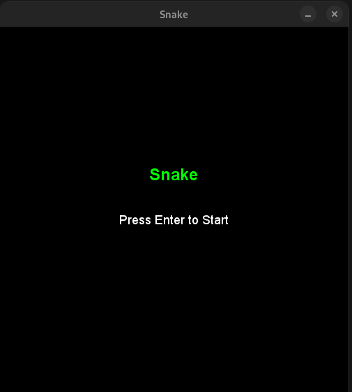
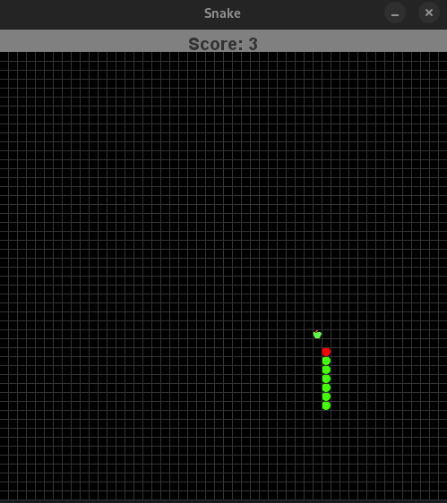
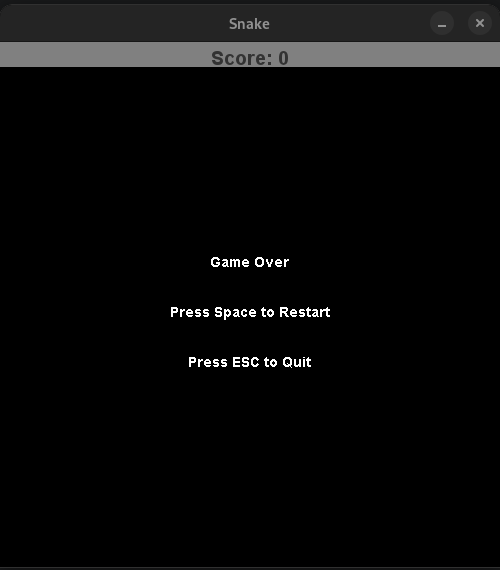

# Snake Game

Basic snake game written in java. For better graphics representation the game was 
implemented into GUI with help of Java AWT and Java Swing.

 ## Requirements

- Java 17

## Instructions

Before opening the program compile the code within the ***src*** folder with java compiler. 
After that you will be able to run the program which should result in the following window:

To start the game follow the instructions in the window. This will update it into the following:

Whenever the game ends, the window will be updated to the final stage:

## Key Bindings List

- Arrows - change the movement directon of snake
- Enter - start the game
- Escape - close program at any given moment
- Space - restart the game (only possible in final window)

